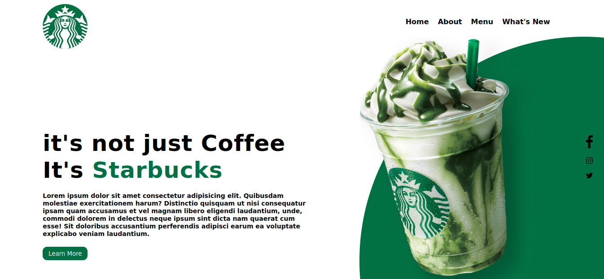

# Um **SIMPLES** site do starucks




### **HTML**
```
<!DOCTYPE html>
<html lang="en">
<head>
    <meta charset="UTF-8">
    <meta name="viewport" content="width=device-width, initial-scale=1.0">
    <title>Document</title>
    <link rel="stylesheet" href="css/style.css">
</head>
<body>
    <header>
        <dir class="center">
            <div class="logo"></div>
            <nav class="menu">
                <a href="#">Home</a>
                <a href="#">About</a>
                <a href="#">Menu</a>
                <a href="#">What's New</a>
            </nav>
        </dir>
    </header>
    <section class="about">
        <div class="extras">
            
            <div class="social-media">
                <a href="#"></a>
                <a href="#"></a>
                <a href="#"></a>
            </div>
        </div>
        <div class="center">
            <div class="texto-sobre">
                <h1>it's not just Coffee<br>It's <span>Starbucks</span></h1>
                <p>Lorem ipsum dolor sit amet consectetur adipisicing elit.
                 Quibusdam molestiae exercitationem harum? Distinctio quisquam
                  ut nisi consequatur ipsam quam accusamus et vel magnam libero
                   eligendi laudantium, unde, commodi dolorem in delectus
                    neque ipsum sint dicta nam quaerat cum esse!
                     Sit doloribus accusantium perferendis adipisci earum
                      ea voluptate explicabo veniam laudantium.</p>
                      <button type="button">Learn More</button>
            </div>
        </div>
    </section>
</body>
</html>
```

### **CSS**
```
*{
    margin: 0;
    box-sizing: border-box;
    padding: 0;
    font-family: Verdana, Geneva, Tahoma, sans-serif;
    resize: none;
}
html,body{
    height: 100%;
    overflow-y: hidden;
    overflow-x: hidden;
}
.center{
    display: flex;
    flex-wrap: wrap;
    max-width: 1200px;
    margin: 0 auto;
    padding: 0 2%;
}
.logo{
    width: 50%;
}
header{
    height: 200px;
    padding: 20px 0;
}
.menu{
    padding: 30px 0;
    width: 50%;
    text-align: right;
}
.menu a{
    text-decoration: none;
    color: #000000;
    font-weight: bold;
    margin-right: 15px;
    transition: 0.3s;
    cursor: pointer;
}
.menu a:hover{
    color: #017143;
}
section.sobre{
    height: calc(100% - 200px);
    position: relative;
}
.extras{
    position: absolute;
    bottom: -450px;
    right: -450px;
    height: 1000px;
    width: 1000px;
    background-color: #017143;
    border-radius: 50%;
}
.social-media{
    position: absolute;
    right: 480px;
    top: 200px;
}
.social-media img{
    display: block;
    width: 15px;
    margin: 20px 0;
}
span{
    color: #017143;
}
.texto-sobre{
    margin-top: 100px;
}
.texto-sobre h1{
    font-size: 50px;
    letter-spacing: 1px;
}
.texto-sobre p{
    margin: 20px 0;
    color: #000000;
    font-size: 14px;
    font-weight: bold;
    max-width: 600px;
}
.texto-sobre button{
    border: none;
    background-color: #017143;
    color: #FFFFFF;
    border-radius: 10px;
    width: 100px;
    height: 30px;
    cursor: pointer;
}
```